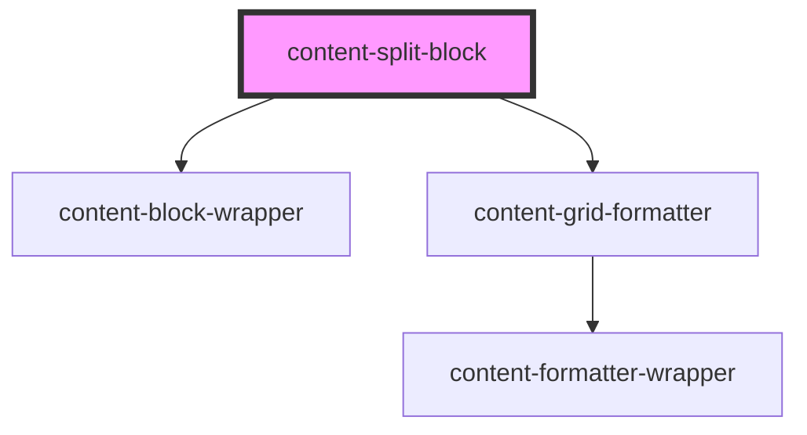

# content-split-block

<!-- Auto Generated Below -->

## Properties

| Property     | Attribute    | Description | Type      | Default     |
| ------------ | ------------ | ----------- | --------- | ----------- |
| `background` | `background` |             | `string`  | `undefined` |
| `reverse`    | `reverse`    |             | `boolean` | `false`     |

## Slots

| Slot        | Description            |
| ----------- | ---------------------- |
| `"column1"` | This will be column 1. |
| `"column2"` | This will be column 2. |

## Dependencies

### Depends on

- [content-block-wrapper](../../wrappers/content-block-wrapper)
- [content-grid-formatter](../../formatters/content-grid-formatter)

### Graph

----------------------------------------------

