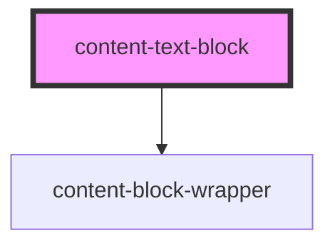

# content-text-block

<!-- Auto Generated Below -->

## Properties

| Property            | Attribute            | Description                                                                                                                                                                                                           | Type     | Default            |
| ------------------- | -------------------- | --------------------------------------------------------------------------------------------------------------------------------------------------------------------------------------------------------------------- | -------- | ------------------ |
| `background`        | `background`         |                                                                                                                                                                                                                       | `string` | `undefined`        |
| `colorClass`        | `color-class`        | This is a string representing the theme class. This value must be  created in a custom theme stylesheet using `@include responsiveProperty`. This will output in the following format: `theme-${breakpoint}-${value}` | `string` | `'color--default'` |
| `verticalAlignment` | `vertical-alignment` | Pipe separated list of ContentVerticalAlignments for text box placement.                                                                                                                                              | `string` | `'top'`            |

## Dependencies

### Depends on

- [content-block-wrapper](../../wrappers/content-block-wrapper)

### Graph

----------------------------------------------

