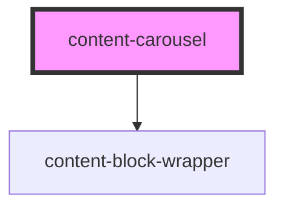

# content-carousel

<!-- Auto Generated Below -->

## Properties

| Property           | Attribute           | Description | Type                | Default                                                                        |
| ------------------ | ------------------- | ----------- | ------------------- | ------------------------------------------------------------------------------ |
| `background`       | `background`        |             | `string`            | `undefined`                                                                    |
| `initMethod`       | `init-method`       |             | `"event" \| "load"` | `'load'`                                                                       |
| `mobileBackground` | `mobile-background` |             | `string`            | `undefined`                                                                    |
| `swiperOptions`    | `swiper-options`    |             | `string`            | `'{"slidesPerView": 1, "slidesPerGroup": 1, "autoplay": true, "loop": false}'` |

## Dependencies

### Depends on

- [content-block-wrapper](../../wrappers/content-block-wrapper)

### Graph

----------------------------------------------

