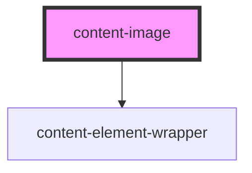

# content-image

<!-- Auto Generated Below -->

## Properties

| Property           | Attribute    | Description | Type      | Default       |
| ------------------ | ------------ | ----------- | --------- | ------------- |
| `alt`              | `alt`        |             | `string`  | `undefined`   |
| `height`           | `height`     |             | `string`  | `'9'`         |
| `lazyLoad`         | `lazy-load`  |             | `boolean` | `true`        |
| `src` _(required)_ | `src`        |             | `string`  | `undefined`   |
| `videoType`        | `video-type` |             | `string`  | `'video/mp4'` |
| `width`            | `width`      |             | `string`  | `'16'`        |

## Dependencies

### Depends on

- [content-element-wrapper](../../wrappers/content-element-wrapper)

### Graph

----------------------------------------------

