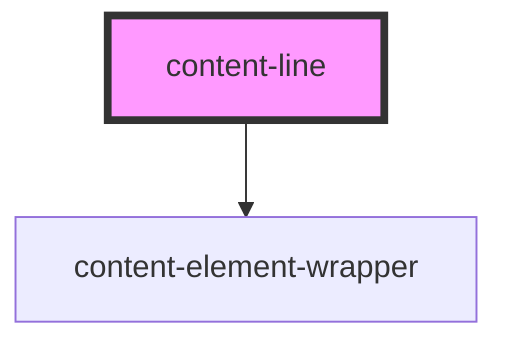

# content-line

<!-- Auto Generated Below -->

## Properties

| Property     | Attribute     | Description                                                                             | Type                                                                                               | Default     |
| ------------ | ------------- | --------------------------------------------------------------------------------------- | -------------------------------------------------------------------------------------------------- | ----------- |
| `maxWidth`   | `max-width`   | Pipe separated list of max width numbers. You can also use units such as "px" and "vw". | `string`                                                                                           | `'100%'`    |
| `styleClass` | `style-class` | The font class for the line.                                                            | `string`                                                                                           | `undefined` |
| `tag`        | `tag`         | The element tag to use.                                                                 | `"article" \| "div" \| "h1" \| "h2" \| "h3" \| "h4" \| "h5" \| "h6" \| "p" \| "section" \| "span"` | `'div'`     |
| `textAlign`  | `text-align`  | Pipe separated list of ContentLineTextAlignOptions for text alignment.                  | `string`                                                                                           | `'default'` |

## Dependencies

### Depends on

- [content-element-wrapper](../../wrappers/content-element-wrapper)

### Graph

----------------------------------------------

