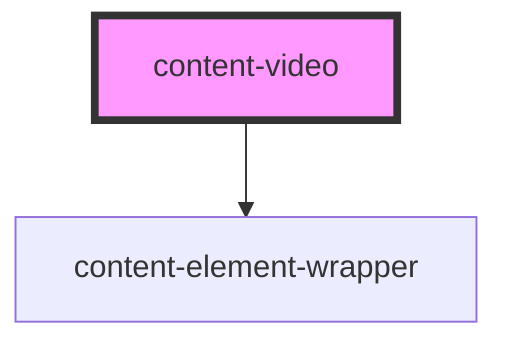

# content-video

<!-- Auto Generated Below -->

## Properties

| Property       | Attribute       | Description                                                                                                                                                                       | Type                   | Default       |
| -------------- | --------------- | --------------------------------------------------------------------------------------------------------------------------------------------------------------------------------- | ---------------------- | ------------- |
| `autoplay`     | `autoplay`      | If you're using this inside a content-overlay for example, you may want the video to play immediately on launch.                                                                  | `boolean`              | `false`       |
| `controls`     | `controls`      |                                                                                                                                                                                   | `boolean`              | `true`        |
| `fitContainer` | `fit-container` | If this video is opened within a container, e.g. a <content-overlay> with a target. The height of the video will fit the container instead of resizing to the video aspect ratio. | `boolean`              | `false`       |
| `height`       | `height`        |                                                                                                                                                                                   | `number`               | `9`           |
| `method`       | `method`        |                                                                                                                                                                                   | `"html5" \| "youtube"` | `'youtube'`   |
| `preload`      | `preload`       |                                                                                                                                                                                   | `string`               | `'metadata'`  |
| `src`          | `src`           |                                                                                                                                                                                   | `string`               | `''`          |
| `styleClasses` | `style-classes` |                                                                                                                                                                                   | `string`               | `''`          |
| `type`         | `type`          |                                                                                                                                                                                   | `string`               | `'video/mp4'` |
| `width`        | `width`         |                                                                                                                                                                                   | `number`               | `16`          |

## Dependencies

### Depends on

- [content-element-wrapper](../../wrappers/content-element-wrapper)

### Graph

----------------------------------------------

