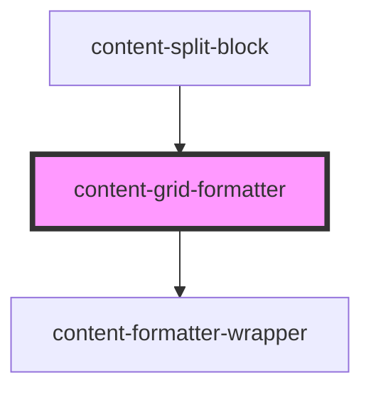

# content-grid-formatter

<!-- Auto Generated Below -->

## Properties

| Property     | Attribute     | Description | Type     | Default           |
| ------------ | ------------- | ----------- | -------- | ----------------- |
| `columns`    | `columns`     |             | `string` | `'1'`             |
| `flexAlign`  | `flex-align`  |             | `string` | `'space-between'` |
| `flexGrow`   | `flex-grow`   |             | `string` | `'false'`         |
| `flexShrink` | `flex-shrink` |             | `string` | `'false'`         |
| `type`       | `type`        |             | `string` | `'flex'`          |

## Slots

| Slot        | Description                                         |
| ----------- | --------------------------------------------------- |
| `"content"` | This slot will usually serve a content text block.  |
| `"media"`   | This slot can either be a video or image component. |

## Dependencies

### Used by

 - [content-split-block](../../blocks/content-split-block)

### Depends on

- [content-formatter-wrapper](../../wrappers/content-formatter-wrapper)

### Graph

----------------------------------------------

