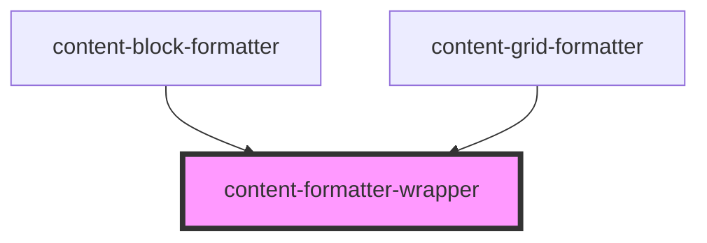

# content-formatter-wrapper

<!-- Auto Generated Below -->

## Properties

| Property       | Attribute       | Description | Type     | Default               |
| -------------- | --------------- | ----------- | -------- | --------------------- |
| `background`   | `background`    |             | `string` | `undefined`           |
| `extraClasses` | `extra-classes` |             | `string` | `''`                  |
| `name`         | `name`          |             | `string` | `'content-formatter'` |

## Dependencies

### Used by

 - [content-block-formatter](../../formatters/content-block-formatter)
 - [content-grid-formatter](../../formatters/content-grid-formatter)

### Graph

----------------------------------------------

