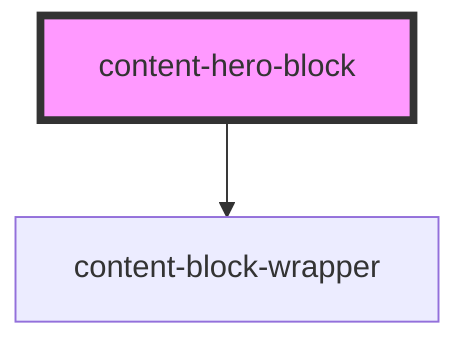

# content-hero-block

<!-- Auto Generated Below -->

## Properties

| Property          | Attribute          | Description                                                                                                    | Type     | Default          |
| ----------------- | ------------------ | -------------------------------------------------------------------------------------------------------------- | -------- | ---------------- |
| `background`      | `background`       |                                                                                                                | `string` | `undefined`      |
| `contentPosition` | `content-position` | Pipe separated HeroContentPlacementOptions that will determine where the content is positioned with the media. | `string` | `'below\|above'` |

## Slots

| Slot        | Description                                         |
| ----------- | --------------------------------------------------- |
| `"content"` | This slot will usually serve a content text block.  |
| `"media"`   | This slot can either be a video or image component. |

## Dependencies

### Depends on

- [content-block-wrapper](../../wrappers/content-block-wrapper)

### Graph

----------------------------------------------

