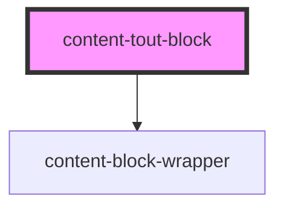

# content-tout-block

<!-- Auto Generated Below -->

## Properties

| Property | Attribute | Description | Type     | Default         |
| -------- | --------- | ----------- | -------- | --------------- |
| `hover`  | `hover`   |             | `string` | `'false\|true'` |

## Slots

| Slot        | Description                                         |
| ----------- | --------------------------------------------------- |
| `"content"` | This slot will usually serve a content text block.  |
| `"media"`   | This slot can either be a video or image component. |

## Dependencies

### Depends on

- [content-block-wrapper](../../wrappers/content-block-wrapper)

### Graph

----------------------------------------------

