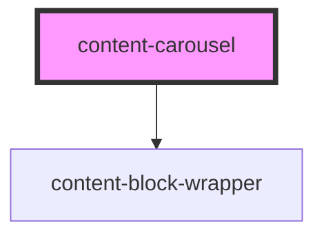

# content-carousel

<!-- Auto Generated Below -->

## Properties

| Property           | Attribute           | Description | Type                | Default     |
| ------------------ | ------------------- | ----------- | ------------------- | ----------- |
| `background`       | `background`        |             | `string`            | `undefined` |
| `initMethod`       | `init-method`       |             | `"event" \| "load"` | `'event'`   |
| `mobileBackground` | `mobile-background` |             | `string`            | `undefined` |
| `swiperOptions`    | `swiper-options`    |             | `string`            | `undefined` |

## Dependencies

### Depends on

- [content-block-wrapper](../../wrappers/content-block-wrapper)

### Graph

----------------------------------------------

