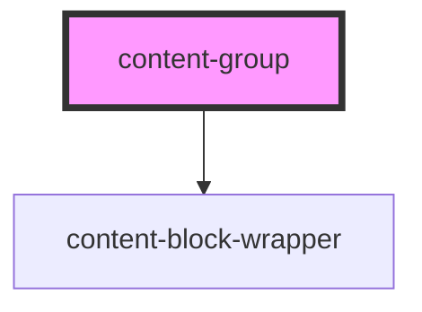

# content-group

<!-- Auto Generated Below -->

## Properties

| Property              | Attribute              | Description                                       | Type     | Default     |
| --------------------- | ---------------------- | ------------------------------------------------- | -------- | ----------- |
| `background`          | `background`           |                                                   | `string` | `undefined` |
| `horizontalAlignment` | `horizontal-alignment` | A ResponsiveString of ContentLineTextAlignOptions | `string` | `'default'` |
| `mobileBackground`    | `mobile-background`    |                                                   | `string` | `undefined` |

## Dependencies

### Depends on

- [content-block-wrapper](../../wrappers/content-block-wrapper)

### Graph

----------------------------------------------

