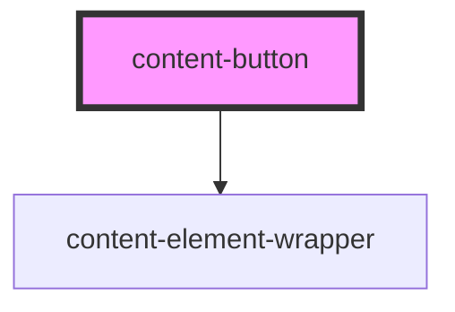

# content-button

<!-- Auto Generated Below -->

## Properties

| Property         | Attribute         | Description | Type      | Default                          |
| ---------------- | ----------------- | ----------- | --------- | -------------------------------- |
| `clickableBlock` | `clickable-block` |             | `boolean` | `false`                          |
| `controls`       | `controls`        |             | `string`  | `undefined`                      |
| `expanded`       | `expanded`        |             | `string`  | `undefined`                      |
| `href`           | `href`            |             | `string`  | `undefined`                      |
| `href2`          | `href-2`          |             | `string`  | `undefined`                      |
| `styleClass`     | `style-class`     |             | `string`  | `'content-block-default-button'` |
| `target`         | `target`          |             | `string`  | `undefined`                      |

## Events

| Event                   | Description | Type                       |
| ----------------------- | ----------- | -------------------------- |
| `contentBlockActivated` |             | `CustomEvent<HTMLElement>` |

## Dependencies

### Depends on

- [content-element-wrapper](../../wrappers/content-element-wrapper)

### Graph

----------------------------------------------

