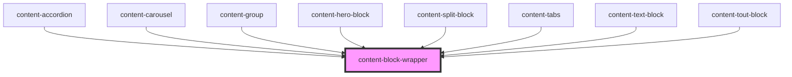

# content-block-wrapper

<!-- Auto Generated Below -->

## Properties

| Property            | Attribute            | Description | Type     | Default           |
| ------------------- | -------------------- | ----------- | -------- | ----------------- |
| `background`        | `background`         |             | `string` | `undefined`       |
| `backgroundClasses` | `background-classes` |             | `string` | `''`              |
| `maxWidth`          | `max-width`          |             | `string` | `'100%'`          |
| `name`              | `name`               |             | `string` | `'content-block'` |
| `styleClasses`      | `style-classes`      |             | `string` | `''`              |

## Events

| Event               | Description | Type                       |
| ------------------- | ----------- | -------------------------- |
| `contentBlockReady` |             | `CustomEvent<HTMLElement>` |

## Dependencies

### Used by

 - [content-accordion](../../components/content-accordion)
 - [content-carousel](../../components/content-carousel)
 - [content-group](../../components/content-group)
 - [content-hero-block](../../blocks/content-hero-block)
 - [content-split-block](../../blocks/content-split-block)
 - [content-tabs](../../components/content-tabs)
 - [content-text-block](../../blocks/content-text-block)
 - [content-tout-block](../../blocks/content-tout-block)

### Graph

----------------------------------------------

