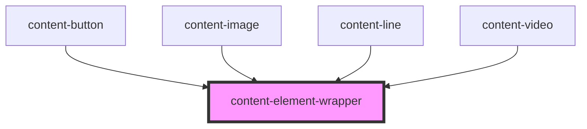

# content-element-wrapper

<!-- Auto Generated Below -->

## Properties

| Property       | Attribute       | Description | Type     | Default             |
| -------------- | --------------- | ----------- | -------- | ------------------- |
| `name`         | `name`          |             | `string` | `'content-element'` |
| `styleClasses` | `style-classes` |             | `string` | `''`                |

## Dependencies

### Used by

 - [content-button](../../elements/content-button)
 - [content-image](../../elements/content-image)
 - [content-line](../../elements/content-line)
 - [content-video](../../elements/content-video)

### Graph

----------------------------------------------

